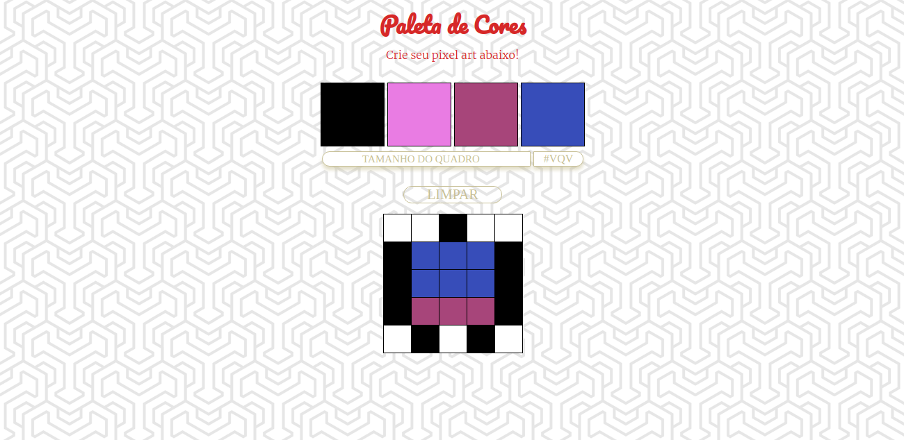

<h1 align="center">Pixels Art</h1>

  

> Projeto para o aprendizado de manipulaçao da DOM, Eventos e Web Storage

> HTML5 | CSS3 | JavaScript

### ✨ [Demo](https://ricardorosa-dev.github.io/projects/03-pixels-art/index.html)

## Author

👤 **Ricardo Rosa**

* Website: http://ricardorosa-dev.github.io/
* Github: [@ricardorosa-dev](https://github.com/ricardorosa-dev)
* LinkedIn: [@https://www.linkedin.com/in/ricardorosa-dev/](https://www.linkedin.com/in/ricardorosa-dev/)

## Show your support

Give a ⭐️ if this project helped you!

***
_This README was generated with ❤️ by [readme-md-generator](https://github.com/kefranabg/readme-md-generator)_
